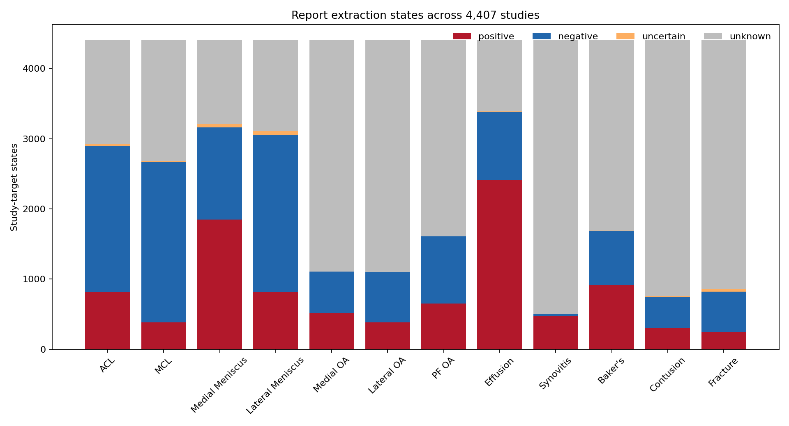
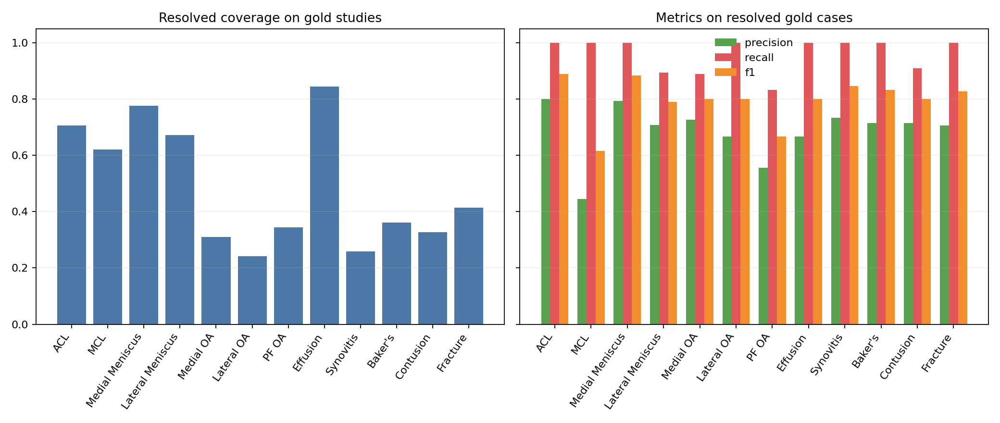

# 03 Report Label Generation

## 1. Executive Summary

Esta etapa implementa una política textual interpretable para transformar los 4,407 reportes de `train.csv` en estados auditables para los 12 targets. La política `report-label-policy-v2.0.0` reconoce evidencia target-específica, negación, normalidad, incertidumbre y menciones colectivas seguras en varios grupos lingüísticos. La ausencia de mención se conserva como `unknown`.

Antes de cualquier override, la extracción se evaluó contra los 58 Studies con labels oficiales completos. La cobertura binaria observada sobre ese conjunto es target-dependiente; las métricas de abajo describen sólo 58 casos y no constituyen evidencia concluyente de generalización. Para la supervisión final se aplicó la prioridad `official > report_derived`, preservando en columnas separadas los valores derived, official y final.

La etapa produce un contrato reusable para el futuro pipeline MRI, pero no procesa DICOM ni píxeles y no entrena ningún modelo visual.

## 2. Previous Stage Connection

La caracterización inicial estableció una fila por `StudyInstanceUID`, 4.407 reportes, 12 targets y sólo 58 filas completamente anotadas. La revisión posterior de notebooks públicos confirmó el flujo `Report → supervisión de entrenamiento → modelo MRI sin Report en inferencia`. Esos dos resultados motivan esta etapa 03 y fijan dos decisiones: el texto sólo construye supervisión y los labels oficiales tienen prioridad únicamente después de evaluar el extractor.

## 3. Objective and Questions

El objetivo fue construir supervisión reproducible desde `Report` sin usar MRI ni metadata de adquisición. Las preguntas operativas fueron: qué evidencia textual permite resolver cada target; cómo distinguir afirmación, negación, incertidumbre y silencio; qué cobertura ofrece una política multilingüe conservadora; cómo se comporta frente al gold set; y qué provenance necesita el siguiente componente.

## 4. Data and Inputs

- Fuente: `data/train.csv`.
- Unidad: `StudyInstanceUID`; 4,407 IDs únicos y ningún duplicado.
- Texto: 4,407 Reports no missing.
- Targets: 12 columnas binarias parcialmente observadas.
- Gold: 58 Studies con los 12 labels completos.
- Variables excluidas: DICOM, PixelData, tablas de Series, scanner y plano anatómico.

## 5. Problem Formulation

Para cada par Study-target se guarda `status ∈ {positive, negative, uncertain, unknown}`. `derived_label` sólo vale 1 o 0 para estados positive/negative; uncertain y unknown permanecen missing. `derived_score` ordena evidencia explícita pero no es una probabilidad calibrada. `confidence` está en `[0,1]` y representa fuerza determinista de evidencia. `official_label` conserva el gold cuando existe. `final_label` usa official y, en su ausencia, un derived binario; `final_source` explicita `official`, `report_derived` o `unresolved`.

## 6. Relevant Text Exploration

La medición por script y marcadores léxicos muestra heterogeneidad sustancial; los grupos son auxiliares reproducibles y no diagnósticos perfectos de idioma.

| language_group | studies | gold_studies | resolved_rate |
| --- | --- | --- | --- |
| cyrillic_script | 220 | 3 | 0.332 |
| dutch | 153 | 2 | 0.353 |
| english | 1724 | 28 | 0.532 |
| french | 80 | 0 | 0.506 |
| german | 259 | 2 | 0.363 |
| greek_script | 321 | 3 | 0.292 |
| latin_other | 22 | 0 | 0.458 |
| south_slavic | 403 | 4 | 0.385 |
| spanish | 678 | 10 | 0.399 |
| turkish | 547 | 6 | 0.339 |

Esta distribución descartó una solución English-only. La tasa `resolved_rate` se calcula sobre los 12 targets por Study y muestra dónde el léxico conservador deja mayor proporción sin resolver.

## 7. Methodology

1. Normalización Unicode determinista: case folding, remoción de diacríticos, guiones y espacios homogéneos, preservando escrituras griega y cirílica.
2. Segmentación en cláusulas y contexto de secciones. Se unen continuaciones con igual indentación que empiezan en minúscula después de coma o de una línea extensa sin puntuación; una línea en blanco impide la unión. Indicaciones, antecedentes y técnica se excluyen de las afirmaciones diagnósticas.
3. Matching target-específico mediante anatomía y vocabulario patológico separado para ligamentos, meniscos y compartimentos OA. Dentro de una cláusula, cada hallazgo se asocia con la anatomía compatible más próxima para evitar contaminación entre targets; los hallazgos directos usan términos propios.
4. Negación, normalidad e incertidumbre se resuelven dentro de la cláusula local.
5. Las menciones colectivas explícitas se expanden sólo cuando la semántica lo permite: una normalidad grupal se propaga con menor confidence; un positivo ambiguo de cruzados o colaterales no se asigna a un miembro particular.
6. Agregación conservadora: positivo explícito, negativo explícito, uncertain o unknown. Los conflictos conservan positivo con menor confidence y evidencia completa.
7. Persistencia evidence-first: se guardan primero las cláusulas que determinan el estado y, si existe conflicto real entre cláusulas distintas, al menos una evidencia discordante visible.
8. Auditoría exhaustiva por fila: schema, provenance, correspondencia entre evidence y cláusula diagnóstica, visibilidad de la evidencia decisiva, rationale y confidence.
9. Evaluación derived vs official antes del override y construcción final con prioridad official y provenance.

## 8. Decisions

- El silencio no es evidencia negativa: queda `unknown`.
- La incertidumbre explícita no se binariza.
- No se usan excepciones por Study ni reglas ajustadas a observaciones puntuales del gold set.
- La confidence es ordinal y determinista, no calibrada; la evidencia colectiva recibe menor valor que una mención target-específica.
- Se usa CSV largo porque es interoperable con las dependencias existentes y no exige un motor Parquet adicional.
- No se infiere Synovitis desde Effusion ni Contusion desde edema inespecífico: esas proxies aumentarían cobertura a costa de cambiar la semántica del target.

La revisión de menor a mayor cobertura lingüística incorporó flexiones y expresiones observadas en el corpus para griego, turco, búlgaro/cirílico, sudeslavo, neerlandés, alemán, español, francés e inglés. La revisión equivalente por target priorizó Synovitis, Contusion y Fracture, luego OA, Baker y finalmente ligamentos, meniscos y Effusion. Los primeros tres conservan baja cobertura porque se evitó reemplazar mención explícita con proxies como derrame, edema medular o normalidad ósea global.

El análisis también rechazó resoluciones previas espurias: la normalidad del menisco dentro de un compartimento no niega OA, y una rotura meniscal próxima al MCL no demuestra lesión del ligamento. Por eso una mejora léxica puede aumentar positivos explícitos mientras una corrección de alcance devuelve otros pares a `unknown`.

## 9. Findings and Results

La política resolvió 22,723 de 52,884 pares Study-target (43.0%). Estados completos: positive=9,754, negative=12,969, uncertain=224, unknown=29,937.

### Observed Evaluation on the Gold Set

| target | gold_positives | gold_negatives | coverage | precision | recall | f1 | fp | fn | unknown | uncertain |
| --- | --- | --- | --- | --- | --- | --- | --- | --- | --- | --- |
| ACL | 24 | 34 | 0.707 | 0.800 | 1.000 | 0.889 | 5 | 0 | 16 | 1 |
| MCL | 9 | 49 | 0.621 | 0.444 | 1.000 | 0.615 | 5 | 0 | 21 | 1 |
| Medial Meniscus | 26 | 32 | 0.776 | 0.793 | 1.000 | 0.885 | 6 | 0 | 13 | 0 |
| Lateral Meniscus | 23 | 35 | 0.672 | 0.708 | 0.895 | 0.791 | 7 | 2 | 17 | 2 |
| Medial OA | 15 | 43 | 0.310 | 0.727 | 0.889 | 0.800 | 3 | 1 | 40 | 0 |
| Lateral OA | 11 | 47 | 0.241 | 0.667 | 1.000 | 0.800 | 3 | 0 | 44 | 0 |
| PF OA | 21 | 37 | 0.345 | 0.556 | 0.833 | 0.667 | 4 | 1 | 38 | 0 |
| Effusion | 35 | 23 | 0.845 | 0.667 | 1.000 | 0.800 | 15 | 0 | 9 | 0 |
| Synovitis | 27 | 31 | 0.259 | 0.733 | 1.000 | 0.846 | 4 | 0 | 43 | 0 |
| Baker's | 12 | 46 | 0.362 | 0.714 | 1.000 | 0.833 | 4 | 0 | 37 | 0 |
| Contusion | 19 | 39 | 0.328 | 0.714 | 0.909 | 0.800 | 4 | 1 | 38 | 1 |
| Fracture | 18 | 40 | 0.414 | 0.706 | 1.000 | 0.828 | 5 | 0 | 34 | 0 |

La figura muestra que coverage y unresolved dependen fuertemente del target; los hallazgos que suelen declararse directamente tienen un patrón distinto de los que requieren anatomía más patología.

La segunda figura separa cobertura de precision/recall/F1. Estas últimas se calculan únicamente entre casos binariamente resueltos; por eso no deben leerse sin la barra de coverage.

## 10. Interpretation

Lo observado establece que una política léxica conservadora puede producir una fracción relevante de labels auditables sin convertir silencios en negativos. No establece que los scores sean probabilidades ni que pequeñas diferencias entre targets se generalicen. El tamaño N=58 amplifica la variabilidad y algunos gold labels pueden codificar una semántica más amplia o distinta de la frase explícita del reporte.

## 11. Error Analysis

El artefacto de error analysis incluye FP, FN, unknown y uncertain con Report y evidencia. Resumen:

| error_type | cases |
| --- | --- |
| unknown | 350 |
| FP | 65 |
| uncertain | 5 |
| FN | 5 |

Los patrones esperables son vocabulario no cubierto, alcance imperfecto de negación, frases con varias estructuras, incertidumbre, variación lingüística y discrepancia report/gold. Una discordancia no se atribuye automáticamente al extractor: reporte y gold pueden representar criterios clínicos o ventanas de información diferentes.

### Consistency Audit

La auditoría evaluó las 52,884 filas y cada elemento de `evidence` persistido. Los issues remanentes se guardan de forma separada; total observado: 0.

| check | severity | evaluated_rows | issue_count | issue_rate | example_study_targets |
| --- | --- | --- | --- | --- | --- |
| unique_study_target | error | 52884 | 0 | 0.000 |  |
| policy_version | error | 52884 | 0 | 0.000 |  |
| evidence_json_schema | error | 52884 | 0 | 0.000 |  |
| evidence_in_diagnostic_clause | error | 52884 | 0 | 0.000 |  |
| status_value_schema | error | 52884 | 0 | 0.000 |  |
| rationale_confidence_schema | error | 52884 | 0 | 0.000 |  |
| final_provenance_schema | error | 52884 | 0 | 0.000 |  |
| decisive_status_visible_in_evidence | error | 22947 | 0 | 0.000 |  |
| conflict_visible_in_evidence | warning | 657 | 0 | 0.000 |  |
| rationale_evidence_mode | warning | 22947 | 0 | 0.000 |  |

## 12. Final Supervision Output

El artefacto final contiene 52,884 filas largas (4,407 Studies × 12 targets). Provenance final: official=696, report_derived=22,382, unresolved=29,806. Hay 81 Studies con los 12 `final_label` resueltos. Los 696 pares gold se preservan como official aun cuando la extracción textual discrepe.

## 13. Artifacts and Figures

- `artifacts/03_report_label_generation/supervision_long_v2.csv`: artefacto principal largo; contiene derived, score, confidence, status, evidencia, official, final y provenance.
- `artifacts/03_report_label_generation/gold_metrics_v2.csv`: métricas por target calculadas antes del override.
- `artifacts/03_report_label_generation/error_analysis_v2.csv`: auditoría de FP, FN, unknown y uncertain sobre los 58 gold Studies.
- `artifacts/03_report_label_generation/language_summary_v2.csv`: resumen de grupos lingüísticos y estados.
- `artifacts/03_report_label_generation/coverage_by_language_target_v2.csv`: grilla completa idioma-target, ordenada de menor a mayor cobertura.
- `artifacts/03_report_label_generation/consistency_audit_summary_v2.csv`: conteos de diez invariantes evaluadas sobre todo el artefacto.
- `artifacts/03_report_label_generation/consistency_audit_issues_v2.csv`: detalle Study-target de cualquier inconsistencia remanente.
- `artifacts/03_report_label_generation/run_metadata_v2.json`: versión de política, input/hash, schema, conteos, hashes y definición de confidence.
- `figures/03_report_label_generation/status_coverage_by_target_v2.png`: composición de estados por target; se interpreta junto con coverage.
- `figures/03_report_label_generation/gold_metrics_by_target_v2.png`: coverage y métricas gold por target; N=58 limita las conclusiones.
- `reports/stages/03_report_label_generation.md`: este registro de conocimiento y decisiones.
- `reports/implementation/03_report_label_generation_implementation.md`: arquitectura, archivos, tests y comandos.

## 14. Limitations

- El gold set tiene 58 Studies y puede no representar todos los idiomas, centros o estilos.
- Los grupos lingüísticos son heurísticos; texto mixto o transliterado puede clasificarse de forma imperfecta.
- Los léxicos no agotan sinonimia, flexión ni errores tipográficos.
- El alcance de negación por cláusula puede fallar en oraciones con varias afirmaciones.
- Unknown y uncertain reducen la cobertura utilizable; esto es una decisión conservadora.
- Algunos targets, en especial Synovitis, pueden no mencionarse aunque estén presentes en MRI.
- Confidence ordena fuerza de evidencia; no está calibrada contra frecuencia clínica.
- Report y gold pueden no codificar exactamente la misma definición o granularidad.

## 15. Conclusions

Queda establecida una segunda política versionada, modular y auditable para `Report → supervisión`. Derived y official se mantienen separados, la evaluación precede al override y los estados no resueltos permanecen missing. Los resultados cuantifican cobertura y errores sin presentar el gold set pequeño como validación definitiva.

## 16. Propuesta conceptual para una eventual v3 — no implementada

Si se busca ampliar cobertura sin diluir precisión, la alternativa prudente no es sumar un segundo generador que vote labels completos, sino combinar evidencia a nivel de mención. Una v3 podría ejecutar en paralelo: reglas comunes de alta precisión; léxicos y patrones morfosintácticos por idioma; y patrones target-específicos para patologías cuya terminología no es intercambiable. Un reconciliador conservaría provenance por span, aplicaría prioridad `target-specific > collective > generic` y sólo emitiría un label cuando alguna rama aporte una mención explícita. El desacuerdo quedaría `uncertain` o requeriría revisión; ninguna rama podría convertir no mención en negativo. Esta arquitectura debería evaluarse contra un gold multilingüe mayor antes de reemplazar v2.

## 17. Next Stage Connection

El siguiente componente puede consumir `final_label`, `final_source`, `confidence` y máscaras de missing por Study-target. La transición prevista es `report-derived + gold supervision → MRI preprocessing/representation → first visual baseline`. Esa etapa deberá usar exclusivamente información visual disponible en inferencia y queda fuera del alcance actual.
