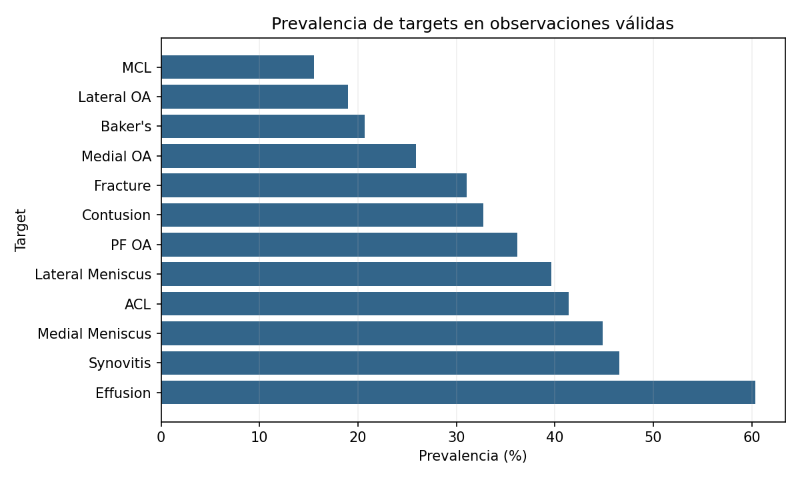
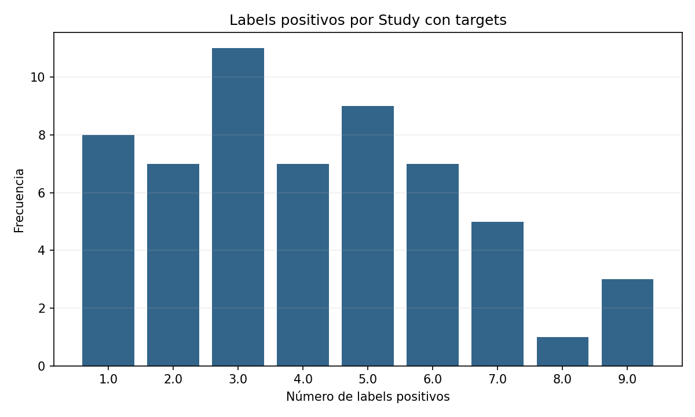
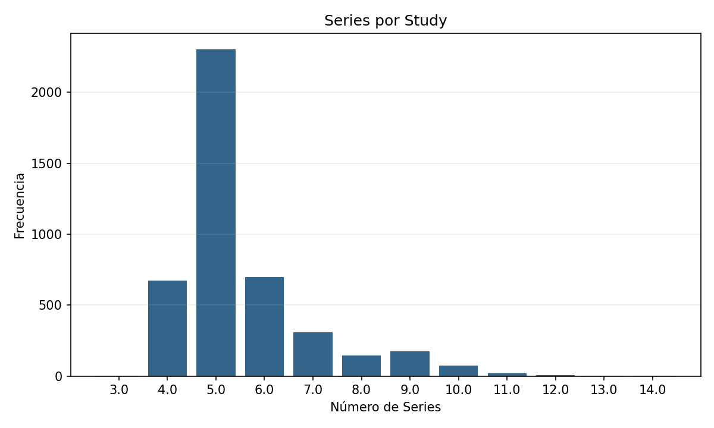
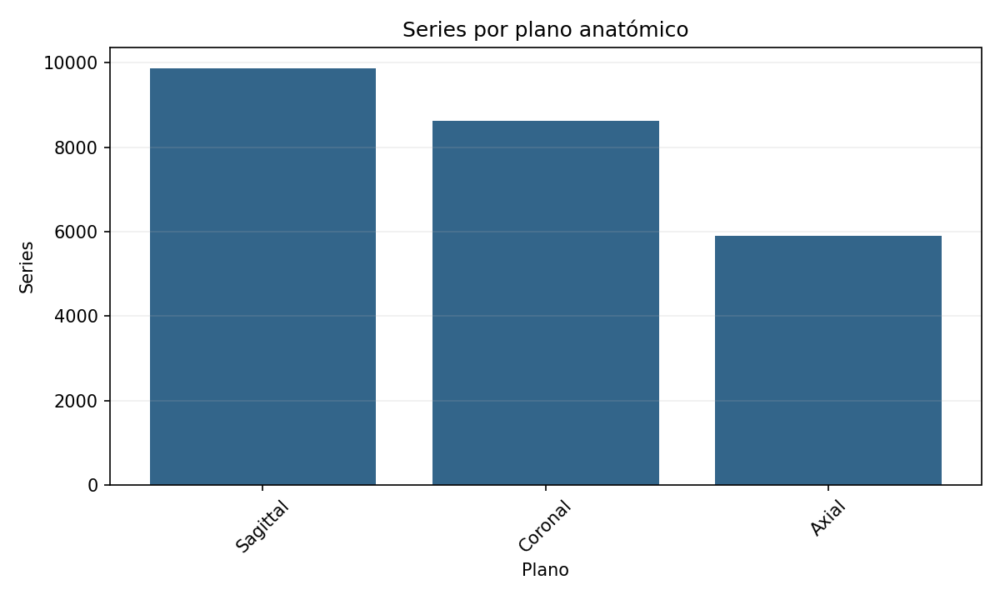
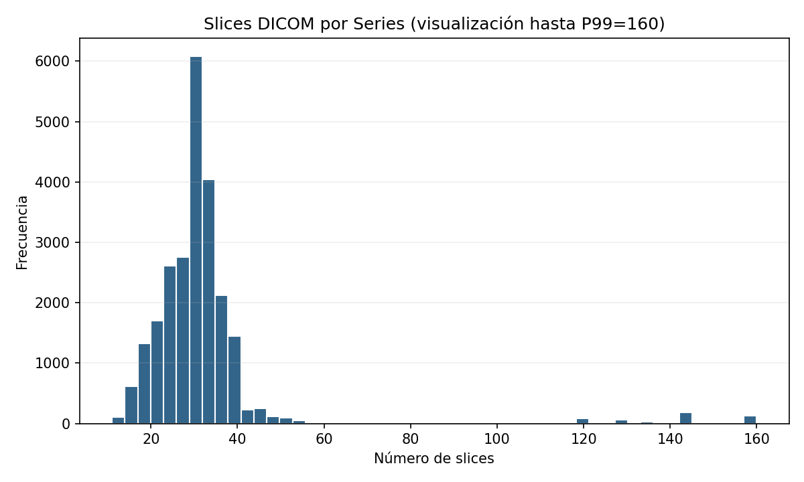
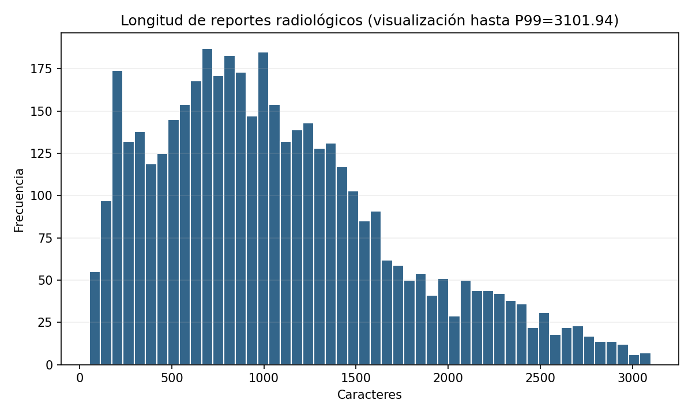
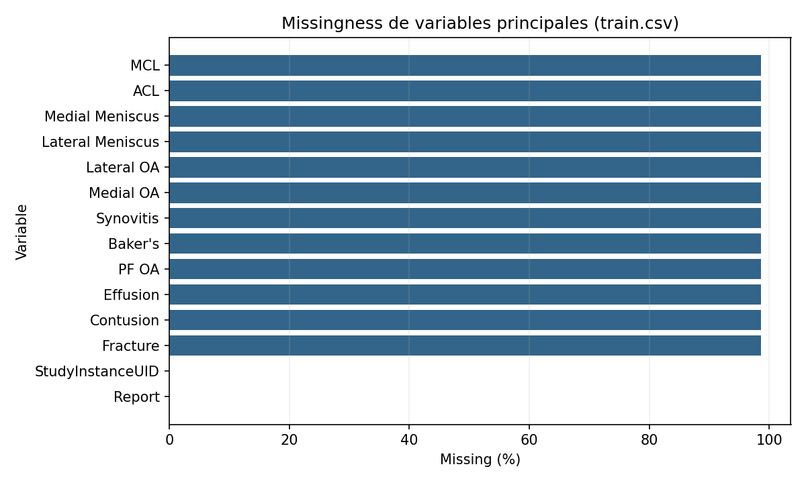

# 01 Dataset Characterization
## Execution Context

**Fecha de ejecución:** 2026-08-10T11:54:42-03:00.  
**Directorio inspeccionado:** `data`.  
**Convención estadística:** todas las varianzas y desviaciones estándar usan la convención poblacional (`ddof=0`).

## 1. Executive Summary

El dataset local contiene 4.407 Studies en train y 3 en test. Las imágenes están organizadas como Study → Series → Slice/DICOM Instance. Se identificaron 24.386 Series tabulares y 819.635 archivos DICOM físicos. `train.csv` aporta un reporte por Study; los 12 targets aparecen únicamente para 58 de 4.407 Studies de train.

La unidad clínica central y de unión es `StudyInstanceUID`. La unidad física mínima es el archivo DICOM (Slice/Instance), mientras que el template `sample_submission.csv` solicita una fila de predicciones por Study. Por ello, unidad de almacenamiento, unidad de label y unidad aparente de predicción no son equivalentes.

### General Dimensions

| Entidad | Cantidad |
| --- | ---: |
| Patients (PatientID observado en DICOM) | 4.410 |
| Studies | 4.410 |
| Series (tabla) | 24.386 |
| Series (directorios físicos) | 24.386 |
| Slices / DICOM Instances | 819.635 |
| Radiology reports | 4.407 |
| Targets | 12 |
| Studies con algún target observado | 58 |
| Archivos totales en data/ | 819.640 |
| Directorios relevantes (incluye data/) | 28.799 |
| Tamaño físico estimado | 500.02 GiB |

### Main Statistics

| Métrica | N | Media | Varianza | SD | P25 | Mediana | P75 | P90 | P95 | P99 | Mín | Máx |
| --- | ---: | ---: | ---: | ---: | ---: | ---: | ---: | ---: | ---: | ---: | ---: | ---: |
| Series por Study | 4.410 | 5,53 | 1,94 | 1,39 | 5,00 | 5,00 | 6,00 | 7,00 | 9,00 | 10,00 | 3,00 | 14,00 |
| Slices por Series | 24.386 | 33,61 | 706,46 | 26,58 | 25,00 | 30,00 | 34,00 | 39,00 | 45,00 | 160,00 | 11,00 | 320,00 |
| Report length (chars) | 4.407 | 1.097,91 | 481.455,84 | 693,87 | 587,50 | 977,00 | 1.459,50 | 2.118,20 | 2.452,70 | 3.101,94 | 52,00 | 4.743,00 |
| Report length (words) | 4.407 | 148,92 | 9.442,91 | 97,17 | 76,00 | 129,00 | 202,00 | 292,00 | 336,00 | 430,00 | 7,00 | 685,00 |
| Studies por PatientID observado | 4.410 | 1,00 | 0,00 | 0,00 | 1,00 | 1,00 | 1,00 | 1,00 | 1,00 | 1,00 | 1,00 | 1,00 |

## 2. File Structure

```text
data/
├── train.csv                         # una fila por Study; Report y targets parcialmente observados
├── train_series.csv                  # una fila por Series
├── test.csv                          # una fila por Study
├── test_series.csv                   # una fila por Series
├── sample_submission.csv             # una fila de predicciones por Study de test
├── train_series/
│   └── <StudyInstanceUID>/<SeriesInstanceUID>/<SOPInstanceUID>.dcm
└── test_series/
    └── <StudyInstanceUID>/<SeriesInstanceUID>/<SOPInstanceUID>.dcm
```

| Extensión | Archivos |
| --- | ---: |
| .csv | 5 |
| .dcm | 819.635 |

El recorrido físico fue exhaustivo para nombres y conteos: 819.640 archivos y 28.799 directorios. El tamaño estimado es 500.02 GiB; se calculó con el tamaño exacto de los 5 archivos raíz y una muestra determinista estratificada de 1.015 DICOM (0 vacíos dentro de lo inspeccionado).

## 3. General Dimensions

| Ratio | Valor |
| --- | ---: |
| Studies / PatientID observado | 1,00 |
| Series / Study | 5,53 |
| Slices / Series | 33,61 |
| Slices / Study | 185,86 |

La cantidad de Patients se basa en `PatientID` leído en una instancia por cada Study; no existe Patient ID en los CSV. La cobertura se detalla más adelante.

## 4. Data Dictionary

| Variable | Archivo | Tipo | Nivel aparente | Valores únicos | Missing % | Ejemplos no nulos | Interpretación descriptiva |
| --- | --- | --- | --- | ---: | ---: | --- | --- |
| StudyInstanceUID | sample_submission.csv | object | Study | 3 | 0,00% | 1.2.826.0.1.3680043.8.498.10047035057544427318018579121635276191; 1.2.826.0.1.3680043.8.498.10062861783145312629332250977456991776; 1.2.826.0.1.3680043.8.498.10067514707072572280263481548497591402 | Identificador DICOM global del MRI Study / Exam. |
| ACL | sample_submission.csv | float64 | Target / Label | 1 | 0,00% | 0.5 | Columna de predicción del template de submission; 0,5 es un valor placeholder. |
| MCL | sample_submission.csv | float64 | Target / Label | 1 | 0,00% | 0.5 | Columna de predicción del template de submission; 0,5 es un valor placeholder. |
| Medial Meniscus | sample_submission.csv | float64 | Target / Label | 1 | 0,00% | 0.5 | Columna de predicción del template de submission; 0,5 es un valor placeholder. |
| Lateral Meniscus | sample_submission.csv | float64 | Target / Label | 1 | 0,00% | 0.5 | Columna de predicción del template de submission; 0,5 es un valor placeholder. |
| Medial OA | sample_submission.csv | float64 | Target / Label | 1 | 0,00% | 0.5 | Columna de predicción del template de submission; 0,5 es un valor placeholder. |
| Lateral OA | sample_submission.csv | float64 | Target / Label | 1 | 0,00% | 0.5 | Columna de predicción del template de submission; 0,5 es un valor placeholder. |
| PF OA | sample_submission.csv | float64 | Target / Label | 1 | 0,00% | 0.5 | Columna de predicción del template de submission; 0,5 es un valor placeholder. |
| Effusion | sample_submission.csv | float64 | Target / Label | 1 | 0,00% | 0.5 | Columna de predicción del template de submission; 0,5 es un valor placeholder. |
| Synovitis | sample_submission.csv | float64 | Target / Label | 1 | 0,00% | 0.5 | Columna de predicción del template de submission; 0,5 es un valor placeholder. |
| Baker's | sample_submission.csv | float64 | Target / Label | 1 | 0,00% | 0.5 | Columna de predicción del template de submission; 0,5 es un valor placeholder. |
| Contusion | sample_submission.csv | float64 | Target / Label | 1 | 0,00% | 0.5 | Columna de predicción del template de submission; 0,5 es un valor placeholder. |
| Fracture | sample_submission.csv | float64 | Target / Label | 1 | 0,00% | 0.5 | Columna de predicción del template de submission; 0,5 es un valor placeholder. |
| StudyInstanceUID | test.csv | object | Study | 3 | 0,00% | 1.2.826.0.1.3680043.8.498.10047035057544427318018579121635276191; 1.2.826.0.1.3680043.8.498.10062861783145312629332250977456991776; 1.2.826.0.1.3680043.8.498.10067514707072572280263481548497591402 | Identificador DICOM global del MRI Study / Exam. |
| StudyInstanceUID | test_series.csv | object | Study | 3 | 0,00% | 1.2.826.0.1.3680043.8.498.10047035057544427318018579121635276191; 1.2.826.0.1.3680043.8.498.10062861783145312629332250977456991776; 1.2.826.0.1.3680043.8.498.10067514707072572280263481548497591402 | Identificador DICOM global del MRI Study / Exam. |
| SeriesInstanceUID | test_series.csv | object | Series | 15 | 0,00% | 1.2.826.0.1.3680043.8.498.11580656442259111255675562605155903947; 1.2.826.0.1.3680043.8.498.17811502614030631664517622518906646132; 1.2.826.0.1.3680043.8.498.30565395595045942404081022062489758495 | Identificador DICOM global de la Series dentro de un Study. |
| Fluid_Sensitive | test_series.csv | int64 | Metadata técnica | 2 | 0,00% | 0; 1 | Indicador binario provisto para caracterizar si la serie es sensible a fluido. |
| Fat_Suppression | test_series.csv | int64 | Metadata técnica | 2 | 0,00% | 0; 1 | Indicador binario provisto para caracterizar supresión de grasa. |
| Anatomical_Plane | test_series.csv | object | Metadata técnica | 3 | 0,00% | Axial; Sagittal; Coronal | Plano anatómico categórico provisto para la serie. |
| StudyInstanceUID | train.csv | object | Study | 4.407 | 0,00% | 1.2.826.0.1.3680043.8.498.10004873229099053869093324292195817260; 1.2.826.0.1.3680043.8.498.10004945927472656027199792075652399585; 1.2.826.0.1.3680043.8.498.10009278692606631573540062909909132231 | Identificador DICOM global del MRI Study / Exam. |
| Report | train.csv | object | Report | 4.276 | 0,00% | longitudes (chars): 322, 245, 1414 | Texto del reporte radiológico asociado al Study. |
| ACL | train.csv | float64 | Target / Label | 2 | 98,68% | 0.0; 1.0 | Label binario observado denominado «ACL» cuando no es missing. |
| MCL | train.csv | float64 | Target / Label | 2 | 98,68% | 0.0; 1.0 | Label binario observado denominado «MCL» cuando no es missing. |
| Medial Meniscus | train.csv | float64 | Target / Label | 2 | 98,68% | 0.0; 1.0 | Label binario observado denominado «Medial Meniscus» cuando no es missing. |
| Lateral Meniscus | train.csv | float64 | Target / Label | 2 | 98,68% | 0.0; 1.0 | Label binario observado denominado «Lateral Meniscus» cuando no es missing. |
| Medial OA | train.csv | float64 | Target / Label | 2 | 98,68% | 0.0; 1.0 | Label binario observado denominado «Medial OA» cuando no es missing. |
| Lateral OA | train.csv | float64 | Target / Label | 2 | 98,68% | 0.0; 1.0 | Label binario observado denominado «Lateral OA» cuando no es missing. |
| PF OA | train.csv | float64 | Target / Label | 2 | 98,68% | 1.0; 0.0 | Label binario observado denominado «PF OA» cuando no es missing. |
| Effusion | train.csv | float64 | Target / Label | 2 | 98,68% | 1.0; 0.0 | Label binario observado denominado «Effusion» cuando no es missing. |
| Synovitis | train.csv | float64 | Target / Label | 2 | 98,68% | 0.0; 1.0 | Label binario observado denominado «Synovitis» cuando no es missing. |
| Baker's | train.csv | float64 | Target / Label | 2 | 98,68% | 0.0; 1.0 | Label binario observado denominado «Baker's» cuando no es missing. |
| Contusion | train.csv | float64 | Target / Label | 2 | 98,68% | 0.0; 1.0 | Label binario observado denominado «Contusion» cuando no es missing. |
| Fracture | train.csv | float64 | Target / Label | 2 | 98,68% | 0.0; 1.0 | Label binario observado denominado «Fracture» cuando no es missing. |
| StudyInstanceUID | train_series.csv | object | Study | 4.407 | 0,00% | 1.2.826.0.1.3680043.8.498.10004873229099053869093324292195817260; 1.2.826.0.1.3680043.8.498.10004945927472656027199792075652399585; 1.2.826.0.1.3680043.8.498.10009278692606631573540062909909132231 | Identificador DICOM global del MRI Study / Exam. |
| SeriesInstanceUID | train_series.csv | object | Series | 24.371 | 0,00% | 1.2.826.0.1.3680043.8.498.12343110195036213483454091715412333772; 1.2.826.0.1.3680043.8.498.13821229744997220641575291927426543265; 1.2.826.0.1.3680043.8.498.23084836536722595275828690293168736174 | Identificador DICOM global de la Series dentro de un Study. |
| Fluid_Sensitive | train_series.csv | int64 | Metadata técnica | 2 | 0,00% | 1; 0 | Indicador binario provisto para caracterizar si la serie es sensible a fluido. |
| Fat_Suppression | train_series.csv | int64 | Metadata técnica | 2 | 0,00% | 1; 0 | Indicador binario provisto para caracterizar supresión de grasa. |
| Anatomical_Plane | train_series.csv | object | Metadata técnica | 3 | 0,00% | Sagittal; Axial; Coronal | Plano anatómico categórico provisto para la serie. |

## 5. Identifiers and Hierarchy

| Archivo | Variable real | Nivel | Cardinalidad | Único en tabla | Filas en grupos duplicados |
| --- | --- | --- | ---: | --- | ---: |
| sample_submission.csv | StudyInstanceUID | Study | 3 | Sí | 0 |
| test.csv | StudyInstanceUID | Study | 3 | Sí | 0 |
| test_series.csv | StudyInstanceUID | Study | 3 | No | 15 |
| test_series.csv | SeriesInstanceUID | Series | 15 | Sí | 0 |
| train.csv | StudyInstanceUID | Study | 4.407 | Sí | 0 |
| train_series.csv | StudyInstanceUID | Study | 4.407 | No | 24.371 |
| train_series.csv | SeriesInstanceUID | Series | 24.371 | Sí | 0 |

La jerarquía empírica observada es:

```text
PatientID (sólo metadata DICOM)
└── StudyInstanceUID
    ├── Report (train.csv)
    ├── 12 targets parcialmente observados (train.csv)
    └── SeriesInstanceUID (tablas y directorios)
        └── SOPInstanceUID.dcm / Slice (archivos y metadata)
```

Series IDs asociados a más de un Study en las tablas: train=0, test=0. 
En headers DICOM leídos: discrepancias path/header de Study UID=0, Series UID=0 y filename/SOP UID=0.

Se observaron 4.410 PatientID únicos para 4.410 Studies con header legible; 0,00% de los Patients tienen más de un Study. La relación observada es uno-a-uno, por lo que `PatientID` podría funcionar como pseudónimo específico del examen y no permite demostrar longitudinalidad real. Al leerse una sola Series por Study, esta pasada tampoco puede detectar contradicciones de PatientID entre Series del mismo Study.

## 6. Analysis and Prediction Units

- **Unidad física de almacenamiento:** un archivo `.dcm` por Slice / DICOM Instance.
- **Granularidad de `*_series.csv`:** una fila por Series.
- **Granularidad de `train.csv` y `test.csv`:** una fila por Study.
- **Unidad de reporte y label:** Study; el reporte y los targets comparten fila con `StudyInstanceUID`.
- **Unidad aparente de predicción:** Study; `sample_submission.csv` contiene una fila por `StudyInstanceUID` de test y una columna por target.

El Study funciona como unidad principal de análisis porque enlaza tablas, Series, DICOM, Report y, cuando están disponibles, targets. Patient sólo se recupera desde headers DICOM; Series y Slice son niveles subordinados de adquisición.

## 7. Targets and Prevalence

Los 12 targets tienen dtype inferido `float64` por la presencia de missing, pero sus 58 valores observados son binarios (0/1). Hay 58 filas con los 12 targets completos y 0 con observación parcial.

| Target | N válido | Positivos | Negativos | Sumatoria | Prevalencia |
| --- | ---: | ---: | ---: | ---: | ---: |
| ACL | 58 | 24 | 34 | 24 | 41,38% |
| MCL | 58 | 9 | 49 | 9 | 15,52% |
| Medial Meniscus | 58 | 26 | 32 | 26 | 44,83% |
| Lateral Meniscus | 58 | 23 | 35 | 23 | 39,66% |
| Medial OA | 58 | 15 | 43 | 15 | 25,86% |
| Lateral OA | 58 | 11 | 47 | 11 | 18,97% |
| PF OA | 58 | 21 | 37 | 21 | 36,21% |
| Effusion | 58 | 35 | 23 | 35 | 60,34% |
| Synovitis | 58 | 27 | 31 | 27 | 46,55% |
| Baker's | 58 | 12 | 46 | 12 | 20,69% |
| Contusion | 58 | 19 | 39 | 19 | 32,76% |
| Fracture | 58 | 18 | 40 | 18 | 31,03% |

Para `n_positive_labels`, calculado sólo en Studies con al menos un target observado: N=58,00, Media=4,14, Varianza=4,88, SD=2,21, P25=2,25, Mediana=4,00, P75=6,00, P90=7,00, P95=8,15, P99=9,00, Mín=1,00, Máx=9,00.

| Labels positivos por Study | Studies |
| ---: | ---: |
| 1 | 8 |
| 2 | 7 |
| 3 | 11 |
| 4 | 7 |
| 5 | 9 |
| 6 | 7 |
| 7 | 5 |
| 8 | 1 |
| 9 | 3 |





## 8. Study-to-Series Composition

La distribución se calculó exhaustivamente sobre directorios físicos. Frecuencias:

| Series por Study | Studies |
| ---: | ---: |
| 3 | 1 |
| 4 | 675 |
| 5 | 2.302 |
| 6 | 698 |
| 7 | 310 |
| 8 | 145 |
| 9 | 176 |
| 10 | 74 |
| 11 | 21 |
| 12 | 5 |
| 13 | 2 |
| 14 | 1 |

El mínimo observado fue 3 Series (1 Studies) y el máximo 14. El umbral P99 es 10,00; 103 Studies se ubican en o por encima de él. Son observaciones descriptivas, no una clasificación automática de outliers.



Las categorías tabulares de adquisición son:

| Variable | Categoría | Series | % |
| --- | --- | ---: | ---: |
| Anatomical_Plane | Sagittal | 9.871 | 40,48% |
| Anatomical_Plane | Coronal | 8.613 | 35,32% |
| Anatomical_Plane | Axial | 5.902 | 24,20% |
| Fluid_Sensitive | 1 | 14.019 | 57,49% |
| Fluid_Sensitive | 0 | 10.367 | 42,51% |
| Fat_Suppression | 1 | 14.019 | 57,49% |
| Fat_Suppression | 0 | 10.367 | 42,51% |



## 9. Series-to-Slice Composition

| Slices por Series | Series |
| ---: | ---: |
| 11 | 52 |
| 12 | 44 |
| 13 | 12 |
| 14 | 12 |
| 15 | 167 |
| 16 | 434 |
| 17 | 117 |
| 18 | 459 |
| 19 | 752 |
| 20 | 671 |
| 21 | 351 |
| 22 | 676 |
| 23 | 500 |
| 24 | 1.079 |
| 25 | 1.034 |
| 26 | 738 |
| 27 | 615 |
| 28 | 1.407 |
| 29 | 1.126 |
| 30 | 4.556 |
| 31 | 397 |
| 32 | 1.851 |
| 33 | 1.144 |
| 34 | 1.050 |
| 35 | 790 |
| 36 | 1.118 |
| 37 | 213 |
| 38 | 546 |
| 39 | 84 |
| 40 | 814 |
| 92 | 4 |
| 96 | 2 |
| 100 | 12 |
| 104 | 1 |
| 106 | 1 |
| 112 | 2 |
| 116 | 2 |
| 120 | 79 |
| 124 | 1 |
| 126 | 2 |
| 128 | 49 |
| 130 | 12 |
| 132 | 3 |
| 134 | 3 |
| 136 | 29 |
| 140 | 23 |
| 144 | 183 |
| 148 | 1 |
| 150 | 4 |
| 152 | 1 |
| 160 | 131 |
| 164 | 2 |
| 172 | 1 |
| 176 | 15 |
| 186 | 50 |
| 192 | 6 |
| 200 | 21 |
| 208 | 2 |
| 254 | 1 |
| 320 | 85 |

Se observaron 287 Series con conteo menor o igual a P1 (15,00) y 314 con conteo mayor o igual a P99 (160,00). La cantidad por sí sola no permite concluir que una Series esté incompleta.



## 10. Radiology Reports

`train.csv` contiene 4.407 reportes no missing asociados por fila a Study, 4.276 textos únicos y 177 filas pertenecientes a grupos de textos exactamente duplicados.

| Sección textual detectada | % de reportes |
| --- | ---: |
| Findings / equivalentes | 38,37% |
| Impression / equivalentes | 30,79% |
| Conclusion / equivalentes | 16,86% |

La detección usa expresiones regulares simples y equivalentes frecuentes en inglés, español y neerlandés. No se estimaron longitudes de sección porque la estructura y el idioma son heterogéneos y una segmentación básica no resultó suficientemente robusta para presentarla como medición.



## 11. DICOM Metadata

Se intentó leer una instancia determinista por Study sobre todos los Studies físicos, con `pydicom.dcmread(..., stop_before_pixels=True)`: 4.410 inspeccionadas, 4.410 correctamente leídas y 0 con problemas. Esta pasada cubre todos los Studies, pero sólo una Series y un Slice por Study.

| Tag | No nulos | Disponibilidad | Cardinalidad | Valores frecuentes (hasta 5) |
| --- | ---: | ---: | ---: | --- |
| PatientID | 4.410 | 100,00% | 4.410 | Valores identificadores omitidos; se informa cardinalidad. |
| StudyInstanceUID | 4.410 | 100,00% | 4.410 | Valores identificadores omitidos; se informa cardinalidad. |
| SeriesInstanceUID | 4.410 | 100,00% | 4.410 | Valores identificadores omitidos; se informa cardinalidad. |
| SOPInstanceUID | 4.410 | 100,00% | 4.410 | Valores identificadores omitidos; se informa cardinalidad. |
| InstanceNumber | 4.410 | 100,00% | 114 | 2 (172); 8 (169); 5 (167); 3 (165); 14 (162) |
| Manufacturer | 4.410 | 100,00% | 12 | Siemens Healthineers (1.054); GE MEDICAL SYSTEMS (869); SIEMENS (804); Philips Medical Systems (718); Philips (492) |
| ManufacturerModelName | 4.410 | 100,00% | 46 | Ingenia (741); MAGNETOM Vida (447); Aera (400); Achieva dStream (327); MAGNETOM Avanto fit (263) |
| MagneticFieldStrength | 4.171 | 94,58% | 6 | 1.5 (2.508); 3 (1.593); 1.500000 (37); 1.16 (24); 3.0 (8) |
| InstitutionName | 0 | 0,00% | 0 | — |
| StationName | 0 | 0,00% | 0 | — |
| ProtocolName | 0 | 0,00% | 0 | — |
| SeriesDescription | 4.212 | 95,51% | 409 | DummySeriesDesc! (558); pd_tse_fs_sag_320 (71); t1_se_cor_384 (70); pd_tse_fs_tra_320 (69); t2_de3d_we_tra_Patella_fit_T (63) |
| SequenceName | 2.110 | 47,85% | 64 | *tse2d1_9 (208); *tseR2d1_7 (159); *tse2d1_3 (151); *se2d1 (91); *tseR2d1rr7 (91) |
| ScanningSequence | 4.171 | 94,58% | 6 | SE (3.933); GR (129); IR (86); RM (18); SE\IR (4) |
| SequenceVariant | 4.171 | 94,58% | 15 | SK (1.709); SP\SK (1.079); SK\SP\OSP (630); SK\OSP (373); NONE (115) |
| Rows | 4.410 | 100,00% | 62 | 512 (1.129); 640 (656); 384 (579); 320 (398); 256 (196) |
| Columns | 4.410 | 100,00% | 62 | 512 (1.132); 384 (573); 640 (541); 320 (351); 256 (194) |
| PixelSpacing | 4.410 | 100,00% | 425 | 0.3125\0.3125 (468); 0.25\0.25 (332); 0.416667\0.416667 (276); 0.332\0.332 (186); 0.5625\0.5625 (129) |
| SliceThickness | 4.410 | 100,00% | 64 | 3 (2.309); 4 (828); 3.5 (278); 2.5 (180); 3.0 (148) |
| SpacingBetweenSlices | 4.093 | 92,81% | 252 | 3.3 (1.528); 3.6 (372); 4.5 (309); 3.5 (192); 4.4 (149) |
| ImagePositionPatient | 4.410 | 100,00% | 4.410 | 25.6259456228936\-121.01967513265\95.6117566520953 (1); 19.441\-140.347\-7.39916 (1); -59.26298523\-77.28578186\84.81910706 (1); -55.6063232422\-110.2986907959\39.9828567505 (1); -80.965252085414\-143.1194283448\98.5467405450254 (1) |
| ImageOrientationPatient | 4.410 | 100,00% | 4.265 | 1\0\0\0\1\0 (20); 1\-2.0510349e-010\0\2.051034897e-010\1\0 (17); 0.99995821714401\-1.156715074E-16\0.00914038904011\1.1454901678E-16\1\1.2332828828E-16 (16); 0.00000000\1.00000000\0.00000000\0.00000000\0.00000000\-1.00000000 (11); -0.1288520456508\0.99166382929479\-1.836937e-009\0.00455977744037\0.00059247377653\-0.9999894286464 (8) |
| Laterality | 2.187 | 49,59% | 5 | R (1.087); L (1.080); RIGHT (12); LEFT (7); B (1) |
| ImageLaterality | 0 | 0,00% | 0 | — |
| BodyPartExamined | 3.995 | 90,59% | 21 | KNEE (3.478); EXTREMITY (444); ANKLE (16); WRIST (14); HEAD (10) |

Combinaciones de dimensiones más frecuentes en las instancias inspeccionadas:

| Rows × Columns | Instancias |
| --- | ---: |
| 512 × 512 | 1.118 |
| 384 × 384 | 554 |
| 640 × 640 | 527 |
| 320 × 320 | 351 |
| 256 × 256 | 194 |
| 1024 × 1024 | 155 |
| 560 × 560 | 106 |
| 704 × 704 | 100 |
| 480 × 480 | 99 |
| 400 × 400 | 91 |
| 528 × 528 | 87 |
| 768 × 768 | 84 |
| 448 × 448 | 81 |
| 416 × 416 | 73 |
| 800 × 800 | 65 |

Laterality combinada (`ImageLaterality` con fallback a `Laterality`):

| Valor | Instancias |
| --- | ---: |
| Ausente | 2.223 |
| R | 1.087 |
| L | 1.080 |
| RIGHT | 12 |
| LEFT | 7 |
| B | 1 |

La disponibilidad se refiere a los headers inspeccionados. Para valores que pueden variar por slice (por ejemplo, posición o `InstanceNumber`), no representa una enumeración exhaustiva de todas las instancias.

## 12. Missingness and Completeness

| Partición | Studies | Con fila en series CSV | Con directorio físico | Con Report | Con targets | Con PatientID observado | Presentes en tabla + series CSV + físico |
| --- | ---: | ---: | ---: | ---: | ---: | ---: | ---: |
| train | 4.407 | 100,00% | 100,00% | 100,00% | 1,32% | 100,00% | 4.407 |
| test | 3 | 100,00% | 100,00% | No disponible | No disponible | 100,00% | 3 |

El missingness más marcado en las variables principales corresponde a los targets de `train.csv`; los IDs, Report y campos de las tablas de Series no presentan missing. Los porcentajes DICOM por tag figuran en la sección anterior.



## 13. Duplicates and Basic Integrity

| Tabla | Filas | Filas exactamente duplicadas (adicionales) |
| --- | ---: | ---: |
| sample_submission.csv | 3 | 0 |
| test.csv | 3 | 0 |
| test_series.csv | 15 | 0 |
| train.csv | 4.407 | 0 |
| train_series.csv | 24.371 | 0 |

- Archivos vacíos en la muestra de tamaño (1.015 DICOM más archivos raíz): 0.
- Series físicas sin DICOM: 0.
- Headers DICOM inspeccionados con error: 0.
- Discrepancias Study UID path/header: 0.
- Discrepancias Series UID path/header: 0.
- Discrepancias SOP UID filename/header: 0.
- SOPInstanceUID duplicados entre headers inspeccionados: 0.
- Paths duplicados entre headers inspeccionados: 0.
- Paths inesperados fuera del patrón Study/Series/Slice: 0.

Los conteos de duplicados no implican por sí solos que las observaciones sean erróneas; identifican repeticiones que pueden revisarse posteriormente.

## 14. Descriptive Train/Test Comparison

| Métrica | Train | Test |
| --- | ---: | ---: |
| Studies (tabla principal) | 4.407,00 | 3,00 |
| Series (tabla de series) | 24.371,00 | 15,00 |
| Series físicas | 24.371,00 | 15,00 |
| Slices DICOM | 819.078,00 | 557,00 |
| Media series / Study | 5,53 | 5,00 |
| Media slices / Series | 33,61 | 37,13 |
| Mediana slices / Series | 30,00 | 30,00 |

| Anatomical_Plane | Train | Test |
| --- | ---: | ---: |
| Axial | 5.898 | 4 |
| Coronal | 8.609 | 4 |
| Sagittal | 9.864 | 7 |

Frecuencias DICOM observables en la instancia inspeccionada por Study (hasta 10 categorías por variable y partición):

| Partición | Variable | Valor | Studies inspeccionados | % no missing de la variable |
| --- | --- | --- | ---: | ---: |
| train | Manufacturer | Siemens Healthineers | 1.053 | 23,89% |
| train | Manufacturer | GE MEDICAL SYSTEMS | 868 | 19,70% |
| train | Manufacturer | SIEMENS | 804 | 18,24% |
| train | Manufacturer | Philips Medical Systems | 718 | 16,29% |
| train | Manufacturer | Philips | 492 | 11,16% |
| train | Manufacturer | TOSHIBA | 181 | 4,11% |
| train | Manufacturer | Siemens | 94 | 2,13% |
| train | Manufacturer | Philips Healthcare | 91 | 2,06% |
| train | Manufacturer | CANON_MEC | 45 | 1,02% |
| train | Manufacturer | GEHC | 37 | 0,84% |
| train | MagneticFieldStrength | 1.5 | 2.506 | 60,11% |
| train | MagneticFieldStrength | 3 | 1.593 | 38,21% |
| train | MagneticFieldStrength | 1.500000 | 37 | 0,89% |
| train | MagneticFieldStrength | 1.16 | 24 | 0,58% |
| train | MagneticFieldStrength | 3.0 | 8 | 0,19% |
| train | MagneticFieldStrength | 1 | 1 | 0,02% |
| train | Rows × Columns | 512 × 512 | 1.117 | 25,35% |
| train | Rows × Columns | 384 × 384 | 554 | 12,57% |
| train | Rows × Columns | 640 × 640 | 526 | 11,94% |
| train | Rows × Columns | 320 × 320 | 351 | 7,96% |
| train | Rows × Columns | 256 × 256 | 194 | 4,40% |
| train | Rows × Columns | 1024 × 1024 | 155 | 3,52% |
| train | Rows × Columns | 560 × 560 | 106 | 2,41% |
| train | Rows × Columns | 704 × 704 | 100 | 2,27% |
| train | Rows × Columns | 480 × 480 | 99 | 2,25% |
| train | Rows × Columns | 400 × 400 | 91 | 2,06% |
| test | Manufacturer | Siemens Healthineers | 1 | 33,33% |
| test | Manufacturer | TOSHIBA | 1 | 33,33% |
| test | Manufacturer | GE MEDICAL SYSTEMS | 1 | 33,33% |
| test | MagneticFieldStrength | 1.5 | 2 | 100,00% |
| test | Rows × Columns | 960 × 960 | 1 | 33,33% |
| test | Rows × Columns | 640 × 640 | 1 | 33,33% |
| test | Rows × Columns | 512 × 512 | 1 | 33,33% |

Las diferencias anteriores son exclusivamente descriptivas. Test no contiene labels ni reportes, por lo que no se calculan prevalencias ni longitudes de texto para esa partición.

## 15. Additional Observations

- `sample_submission.csv` contiene exactamente una fila por cada Study ID de test y 12 columnas con valores placeholder de 0,5.
- `Fluid_Sensitive`, `Fat_Suppression` y `Anatomical_Plane` caracterizan Series en tablas separadas de los headers DICOM.
- Los reportes muestran heterogeneidad de idioma y formato; aquí sólo se midieron presencia, duplicación y longitud, sin interpretación clínica.
- Los targets faltantes no se trataron como negativos; toda prevalencia usa únicamente observaciones válidas.

## 16. Limitations

- La metadata DICOM se extrajo de una instancia determinista por Study, sin PixelData. Los conteos físicos de Series y slices sí son exhaustivos.
- El tamaño total es una estimación basada en 1.015 DICOM estratificados por partición; no se ejecutó `stat` sobre cada archivo por su costo observado.
- PatientID no existe en tablas y se reconstruye desde esa inspección de headers; sus métricas deben leerse con esa procedencia.
- No se realizó validación clínica ni evaluación semántica de reportes o targets.
- La detección de secciones textuales es léxica y multilingüe básica, no un pipeline NLP.
- No se calculó el número de `SeriesDescription` distintas por Study: la extracción de headers usa una sola Series por Study; `ProtocolName` resultó ausente en todos los headers inspeccionados.
- No se cargaron píxeles ni se verificó la calidad visual de las imágenes.

## 17. Glossary

#### Patient

Persona identificada mediante `PatientID` en metadata DICOM; puede tener uno o más Studies.

#### Study / MRI Exam

Examen completo de resonancia magnética, identificado por `StudyInstanceUID`; es la unidad central del dataset.

#### Series

Conjunto de imágenes adquiridas bajo una configuración o secuencia común dentro de un Study.

#### Slice / DICOM Instance

Imagen individual de una Series; múltiples slices representan posiciones dentro del volumen adquirido.

### MRI / Magnetic Resonance Imaging

Técnica de imagen médica basada en campos magnéticos y radiofrecuencia.

#### DICOM

Estándar de archivo y metadata para imágenes médicas digitales.

#### Radiology report

Texto producido durante la interpretación radiológica del examen.

#### Findings

Sección del reporte que describe los hallazgos observados.

#### Impression / Conclusion

Sección de síntesis o conclusión del reporte.

#### Sagittal

Plano que divide anatómicamente el cuerpo en porciones izquierda y derecha.

#### Coronal

Plano que divide anatómicamente el cuerpo en porciones anterior y posterior.

#### Axial

Plano transversal que divide anatómicamente el cuerpo en porciones superior e inferior.

#### Fluid sensitive

Característica de una secuencia en la que el líquido tiende a presentar señal destacada.

#### Fat suppression / fat-sat

Técnica que reduce la señal de la grasa en una secuencia MRI.

#### T1 / T2 / proton density (PD)

Tipos de ponderación MRI que enfatizan propiedades diferentes de los tejidos; no se infirieron aquí más allá de campos explícitos.

#### Slice thickness

Espesor físico representado por un slice, usualmente expresado en milímetros.

#### Pixel spacing

Separación física entre centros de píxeles contiguos dentro del plano de la imagen.

#### Field of view

Extensión anatómica cubierta por una adquisición; no se calculó cuando no existía como campo directo.

#### Laterality

Lado anatómico, típicamente izquierdo o derecho.

#### Magnetic field strength

Intensidad del campo magnético del scanner, habitualmente expresada en teslas.

#### MRI protocol

Conjunto planificado de adquisiciones utilizado para un examen.

#### MRI sequence

Configuración de pulsos y parámetros que determina el contraste de una adquisición.

#### ACL / MCL

Ligamento cruzado anterior / ligamento colateral medial; nombres de targets provistos por el dataset.

#### Meniscus

Estructura fibrocartilaginosa de la rodilla; el dataset distingue medial y lateral.

#### OA

Abreviatura de osteoartritis en los nombres de targets; `PF` refiere al compartimento patelofemoral.

#### Effusion

Presencia de líquido articular aumentada, como denominación de un target.

#### Synovitis

Inflamación de la membrana sinovial, como denominación de un target.

#### Baker's

Referencia al quiste de Baker en el nombre de un target.

#### Contusion

Contusión, como denominación de un target.

#### Fracture

Fractura, como denominación de un target.

## Reproduction

Desde la raíz del repositorio:

```powershell
python scripts/dataset_characterization.py
```

Dependencias usadas: Python 3.10.11, pandas 2.3.3, numpy 2.2.6, matplotlib 3.10.9, pydicom 3.0.1. No se usa aleatoriedad.
