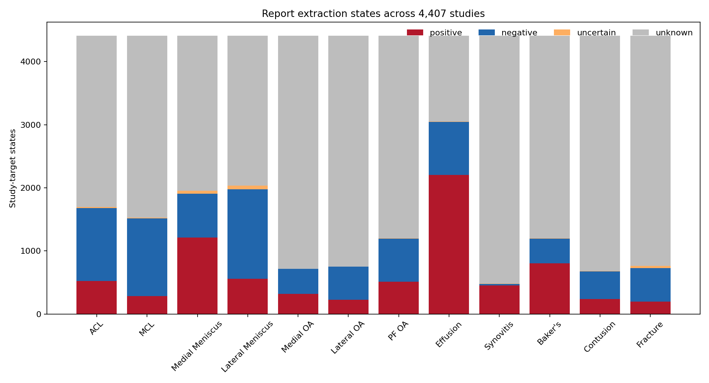
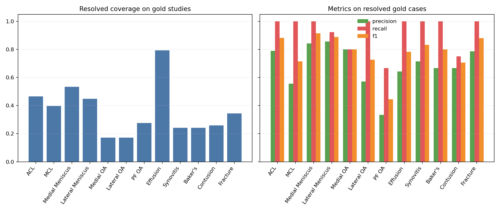

# 03 - Generación reproducible de labels desde Report

## 1. Resumen ejecutivo

Esta etapa implementa una política textual interpretable para transformar los 4,407 reportes de `train.csv` en estados auditables para los 12 targets. La política `report-label-policy-v1.0.0` reconoce evidencia target-específica, negación, normalidad e incertidumbre en varios grupos lingüísticos. La ausencia de mención se conserva como `unknown`.

Antes de cualquier override, la extracción se evaluó contra los 58 Studies con labels oficiales completos. La cobertura binaria observada sobre ese conjunto es target-dependiente; las métricas de abajo describen sólo 58 casos y no constituyen evidencia concluyente de generalización. Para la supervisión final se aplicó la prioridad `official > report_derived`, preservando en columnas separadas los valores derived, official y final.

La etapa produce un contrato reusable para el futuro pipeline MRI, pero no procesa DICOM ni píxeles y no entrena ningún modelo visual.

## 2. Conexión con la etapa anterior

La caracterización inicial estableció una fila por `StudyInstanceUID`, 4.407 reportes, 12 targets y sólo 58 filas completamente anotadas. La revisión posterior de notebooks públicos confirmó el flujo `Report → supervisión de entrenamiento → modelo MRI sin Report en inferencia`. Esos dos resultados motivan esta etapa 03 y fijan dos decisiones: el texto sólo construye supervisión y los labels oficiales tienen prioridad únicamente después de evaluar el extractor.

## 3. Objetivo y preguntas

El objetivo fue construir supervisión reproducible desde `Report` sin usar MRI ni metadata de adquisición. Las preguntas operativas fueron: qué evidencia textual permite resolver cada target; cómo distinguir afirmación, negación, incertidumbre y silencio; qué cobertura ofrece una política multilingüe conservadora; cómo se comporta frente al gold set; y qué provenance necesita el siguiente componente.

## 4. Datos utilizados

- Fuente: `data/train.csv`.
- Unidad: `StudyInstanceUID`; 4,407 IDs únicos y ningún duplicado.
- Texto: 4,407 Reports no missing.
- Targets: 12 columnas binarias parcialmente observadas.
- Gold: 58 Studies con los 12 labels completos.
- Variables excluidas: DICOM, PixelData, tablas de Series, scanner y plano anatómico.

## 5. Formulación del problema

Para cada par Study-target se guarda `status ∈ {positive, negative, uncertain, unknown}`. `derived_label` sólo vale 1 o 0 para estados positive/negative; uncertain y unknown permanecen missing. `derived_score` ordena evidencia explícita pero no es una probabilidad calibrada. `confidence` está en `[0,1]` y representa fuerza determinista de evidencia. `official_label` conserva el gold cuando existe. `final_label` usa official y, en su ausencia, un derived binario; `final_source` explicita `official`, `report_derived` o `unresolved`.

## 6. Exploración textual relevante

La medición por script y marcadores léxicos muestra heterogeneidad sustancial; los grupos son auxiliares reproducibles y no diagnósticos perfectos de idioma.

| language_group | studies | gold_studies | resolved_rate |
| --- | --- | --- | --- |
| cyrillic_script | 220 | 3 | 0.096 |
| dutch | 153 | 2 | 0.179 |
| english | 1465 | 24 | 0.559 |
| french | 80 | 0 | 0.385 |
| german | 255 | 2 | 0.136 |
| greek_script | 321 | 3 | 0.114 |
| latin_other | 368 | 5 | 0.197 |
| south_slavic | 321 | 3 | 0.129 |
| spanish | 678 | 10 | 0.177 |
| turkish | 546 | 6 | 0.215 |

Esta distribución descartó una solución English-only. La tasa `resolved_rate` se calcula sobre los 12 targets por Study y muestra dónde el léxico conservador deja mayor proporción sin resolver.

## 7. Metodología

1. Normalización Unicode determinista: case folding, remoción de diacríticos y espacios homogéneos, preservando escrituras griega y cirílica.
2. Segmentación en cláusulas y contexto de secciones. Indicaciones, antecedentes y técnica se excluyen de las afirmaciones diagnósticas.
3. Matching target-específico mediante anatomía y vocabulario patológico para ligamentos, meniscos y compartimentos OA; los hallazgos directos usan términos propios.
4. Negación, normalidad e incertidumbre se resuelven dentro de la cláusula local.
5. Agregación conservadora: positivo explícito, negativo explícito, uncertain o unknown. Los conflictos conservan positivo con menor confidence y evidencia completa.
6. Evaluación derived vs official antes del override.
7. Construcción final con prioridad official y persistencia de provenance.

## 8. Decisiones

- El silencio no es evidencia negativa: queda `unknown`.
- La incertidumbre explícita no se binariza.
- No se usan excepciones por Study ni reglas ajustadas a observaciones puntuales del gold set.
- La confidence es ordinal y determinista, no calibrada.
- Se usa CSV largo porque es interoperable con las dependencias existentes y no exige un motor Parquet adicional.
- No se infiere Synovitis desde Effusion ni Contusion desde edema inespecífico: esas proxies aumentarían cobertura a costa de cambiar la semántica del target.

## 9. Findings / resultados

La política resolvió 15,847 de 52,884 pares Study-target (30.0%). Estados completos: positive=7,524, negative=8,323, uncertain=197, unknown=36,840.

### Evaluación observada sobre gold

| target | gold_positives | gold_negatives | coverage | precision | recall | f1 | fp | fn | unknown | uncertain |
| --- | --- | --- | --- | --- | --- | --- | --- | --- | --- | --- |
| ACL | 24 | 34 | 0.466 | 0.789 | 1.000 | 0.882 | 4 | 0 | 31 | 0 |
| MCL | 9 | 49 | 0.397 | 0.556 | 1.000 | 0.714 | 4 | 0 | 34 | 1 |
| Medial Meniscus | 26 | 32 | 0.534 | 0.842 | 1.000 | 0.914 | 3 | 0 | 27 | 0 |
| Lateral Meniscus | 23 | 35 | 0.448 | 0.857 | 0.923 | 0.889 | 2 | 1 | 30 | 2 |
| Medial OA | 15 | 43 | 0.172 | 0.800 | 0.800 | 0.800 | 1 | 1 | 48 | 0 |
| Lateral OA | 11 | 47 | 0.172 | 0.571 | 1.000 | 0.727 | 3 | 0 | 48 | 0 |
| PF OA | 21 | 37 | 0.276 | 0.333 | 0.667 | 0.444 | 4 | 1 | 42 | 0 |
| Effusion | 35 | 23 | 0.793 | 0.643 | 1.000 | 0.783 | 15 | 0 | 12 | 0 |
| Synovitis | 27 | 31 | 0.241 | 0.714 | 1.000 | 0.833 | 4 | 0 | 44 | 0 |
| Baker's | 12 | 46 | 0.241 | 0.667 | 1.000 | 0.800 | 4 | 0 | 44 | 0 |
| Contusion | 19 | 39 | 0.259 | 0.667 | 0.750 | 0.706 | 3 | 2 | 42 | 1 |
| Fracture | 18 | 40 | 0.345 | 0.786 | 1.000 | 0.880 | 3 | 0 | 38 | 0 |

La figura muestra que coverage y unresolved dependen fuertemente del target; los hallazgos que suelen declararse directamente tienen un patrón distinto de los que requieren anatomía más patología.

La segunda figura separa cobertura de precision/recall/F1. Estas últimas se calculan únicamente entre casos binariamente resueltos; por eso no deben leerse sin la barra de coverage.

## 10. Interpretación

Lo observado establece que una política léxica conservadora puede producir una fracción relevante de labels auditables sin convertir silencios en negativos. No establece que los scores sean probabilidades ni que pequeñas diferencias entre targets se generalicen. El tamaño N=58 amplifica la variabilidad y algunos gold labels pueden codificar una semántica más amplia o distinta de la frase explícita del reporte.

## 11. Error analysis

El artefacto de error analysis incluye FP, FN, unknown y uncertain con Report y evidencia. Resumen:

| error_type | cases |
| --- | --- |
| unknown | 440 |
| FP | 50 |
| FN | 5 |
| uncertain | 4 |

Los patrones esperables son vocabulario no cubierto, alcance imperfecto de negación, frases con varias estructuras, incertidumbre, variación lingüística y discrepancia report/gold. Una discordancia no se atribuye automáticamente al extractor: reporte y gold pueden representar criterios clínicos o ventanas de información diferentes.

## 12. Supervisión final obtenida

El artefacto final contiene 52,884 filas largas (4,407 Studies × 12 targets). Provenance final: official=696, report_derived=15,595, unresolved=36,593. Hay 81 Studies con los 12 `final_label` resueltos. Los 696 pares gold se preservan como official aun cuando la extracción textual discrepe.

## 13. Artefactos y figuras

- `artifacts/03_report_label_generation/supervision_long_v1.csv`: artefacto principal largo; contiene derived, score, confidence, status, evidencia, official, final y provenance.
- `artifacts/03_report_label_generation/gold_metrics_v1.csv`: métricas por target calculadas antes del override.
- `artifacts/03_report_label_generation/error_analysis_v1.csv`: auditoría de FP, FN, unknown y uncertain sobre los 58 gold Studies.
- `artifacts/03_report_label_generation/language_summary_v1.csv`: resumen de grupos lingüísticos y estados.
- `artifacts/03_report_label_generation/run_metadata_v1.json`: versión de política, input/hash, schema, conteos, hashes y definición de confidence.
- `figures/03_report_label_generation/status_coverage_by_target_v1.png`: composición de estados por target; se interpreta junto con coverage.
- `figures/03_report_label_generation/gold_metrics_by_target_v1.png`: coverage y métricas gold por target; N=58 limita las conclusiones.
- `reports/stages/03 - report label generation.md`: este registro de conocimiento y decisiones.
- `reports/implementation/03 - report label generation implementation.md`: arquitectura, archivos, tests y comandos.

## 14. Limitaciones

- El gold set tiene 58 Studies y puede no representar todos los idiomas, centros o estilos.
- Los grupos lingüísticos son heurísticos; texto mixto o transliterado puede clasificarse de forma imperfecta.
- Los léxicos no agotan sinonimia, flexión ni errores tipográficos.
- El alcance de negación por cláusula puede fallar en oraciones con varias afirmaciones.
- Unknown y uncertain reducen la cobertura utilizable; esto es una decisión conservadora.
- Algunos targets, en especial Synovitis, pueden no mencionarse aunque estén presentes en MRI.
- Confidence ordena fuerza de evidencia; no está calibrada contra frecuencia clínica.
- Report y gold pueden no codificar exactamente la misma definición o granularidad.

## 15. Conclusiones

Queda establecida una primera política oficial, modular y auditable para `Report → supervisión`. Derived y official se mantienen separados, la evaluación precede al override y los estados no resueltos permanecen missing. Los resultados cuantifican cobertura y errores sin presentar el gold set pequeño como validación definitiva.

## 16. Conexión con la siguiente etapa

El siguiente componente puede consumir `final_label`, `final_source`, `confidence` y máscaras de missing por Study-target. La transición prevista es `report-derived + gold supervision → MRI preprocessing/representation → first visual baseline`. Esa etapa deberá usar exclusivamente información visual disponible en inferencia y queda fuera del alcance actual.
