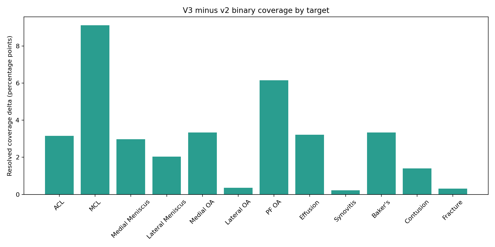
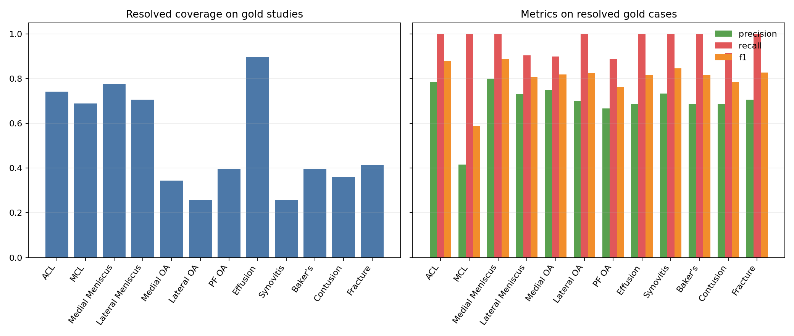
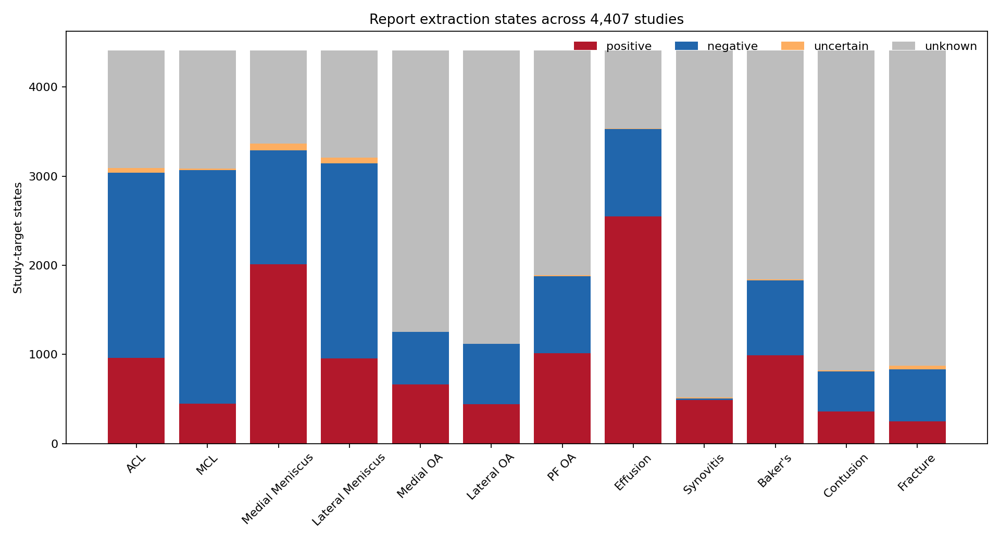

# 03 Report Label Generation — Policy v3

## 1. Resumen ejecutivo

La política `report-label-policy-v3.0.0` implementa una arquitectura de ensemble a nivel de evidencia para los 4,407 `Report`. V3 no vota labels completos: combina menciones exactas, morfología controlada por idioma, relaciones anatómicas target-específicas y estructura del reporte en proposiciones clínicas auditables. La ausencia de una proposición aceptable continúa siendo `unknown`; no se infieren negativos a partir del silencio.

V3 resolvió binariamente 24,294 de 52,884 pares (45.9%). Estados: positive=11,118, negative=13,176, uncertain=294, unknown=28,296. Respecto de v2, 1,902 pares pasaron de `unknown` a un estado binario, 315 hicieron la transición inversa y 213 cambiaron entre positive y negative.

Los 58 estudios oficiales se utilizaron sólo después de congelar la extracción y completar las validaciones corpus-only. Las métricas gold son un sentinel final pequeño, no un conjunto de desarrollo ni una base para ajustar términos o umbrales.

## 2. Qué cambia respecto de v2

| Dimensión | v2 | v3 |
| --- | --- | --- |
| Unidad de combinación | menciones dentro de cláusulas | proposiciones con phenotype y provenance |
| Segmentación | una vista de cláusulas | vistas estrictas y vínculos estructurales de alta confianza |
| Variación lingüística | términos enumerados | exactos más familias morfológicas acotadas |
| Asociación | proximidad local fija | relación target–finding con competencia anatómica |
| OA | términos y anatomía en ventana | scope compartimental target-específico |
| Idioma | grupo descriptivo | hipótesis de routing no exclusivas |
| Persistencia | evidence y rationale | evidence, phenotype, detector, view, rule y confidence |
| No mención | unknown | unknown, sin cambios |

## 3. Metodología

1. Normalización determinista preservando el texto fuente mediante evidence textual.
2. Segmentación multivista: cláusulas estrictas y vistas vinculadas sólo ante encabezados o continuaciones explícitas; no se unen cláusulas adyacentes arbitrarias.
3. Rama exacta v2 conservada como detector común de alta precisión.
4. Morfología controlada sobre formas observadas en el corpus. Cada regla está limitada por target, idioma y exclusiones.
5. Detectores target-específicos para ligamentos, meniscos y OA. La asociación compite con anatomías vecinas y evita asignar una patología al target sólo por coexistir en la oración.
6. Detectores directos estrictos para Effusion, Synovitis, Baker's, Contusion y Fracture.
7. Deduplicación en objetos `Proposition`; la provenance conserva detectores, vistas, reglas, idiomas y phenotype.
8. Reconciliación conservadora positive → uncertain → negative únicamente cuando existe evidencia. Los conflictos reducen confidence y se hacen visibles.
9. Validación corpus-only y comparación con v2.
10. Evaluación final contra los 58 gold, antes del override oficial.

## 4. Coverage por target

| target | pairs | resolved_rate_v2 | resolved_rate_v3 | delta |
| --- | --- | --- | --- | --- |
| MCL | 4407 | 0.605 | 0.696 | 0.091 |
| PF OA | 4407 | 0.365 | 0.426 | 0.061 |
| Baker's | 4407 | 0.382 | 0.415 | 0.033 |
| Medial OA | 4407 | 0.251 | 0.284 | 0.033 |
| Effusion | 4407 | 0.768 | 0.800 | 0.032 |
| ACL | 4407 | 0.658 | 0.690 | 0.032 |
| Medial Meniscus | 4407 | 0.717 | 0.747 | 0.030 |
| Lateral Meniscus | 4407 | 0.693 | 0.713 | 0.020 |
| Contusion | 4407 | 0.169 | 0.183 | 0.014 |
| Lateral OA | 4407 | 0.250 | 0.254 | 0.004 |
| Fracture | 4407 | 0.186 | 0.189 | 0.003 |
| Synovitis | 4407 | 0.113 | 0.115 | 0.002 |

La columna `delta` está expresada como proporción; la figura la presenta en puntos porcentuales. Una ganancia no se interpreta automáticamente como mejora de precisión: debe leerse junto con las transiciones, provenance y evaluación final.

## 5. Idiomas

| language_group | pairs | resolved_rate_v2 | resolved_rate_v3 | delta |
| --- | --- | --- | --- | --- |
| greek_script | 3852 | 0.292 | 0.319 | 0.027 |
| cyrillic_script | 2640 | 0.332 | 0.364 | 0.032 |
| german | 3108 | 0.363 | 0.373 | 0.010 |
| turkish | 6564 | 0.339 | 0.379 | 0.040 |
| spanish | 8136 | 0.399 | 0.403 | 0.004 |
| dutch | 1836 | 0.353 | 0.431 | 0.078 |
| south_slavic | 4836 | 0.385 | 0.467 | 0.082 |
| latin_other | 264 | 0.458 | 0.477 | 0.019 |
| french | 960 | 0.506 | 0.535 | 0.029 |
| english | 20688 | 0.532 | 0.555 | 0.023 |

La implementación prioriza los grupos menos cubiertos mediante reglas morfológicas específicas, pero conserva rutas comunes para términos importados. El grupo de idioma sigue siendo heurístico y no constituye un diagnóstico lingüístico.

## 6. Contribución de detectores y phenotypes

| detector | propositions |
| --- | --- |
| v2_exact | 20688 |
| v3_target | 16387 |
| v3_morphology | 5914 |
| v2_collective | 3898 |

Los conteos representan participación en proposiciones persistidas y pueden superponerse cuando la rama exacta y una regla v3 sostienen la misma evidencia.

| phenotype | propositions |
| --- | --- |
| abnormality_absent | 13460 |
| tear | 7863 |
| abnormality | 5595 |
| normal_structure | 4487 |
| chondral_abnormality | 4065 |
| degeneration | 2501 |
| joint_effusion | 1935 |
| chondral_abnormality_absent | 932 |
| baker_cyst | 917 |
| fracture | 877 |
| normal_cartilage | 865 |
| joint_effusion_absent | 671 |
| fracture_absent | 637 |
| sprain | 593 |
| bone_contusion_absent | 456 |

Separar phenotype de label conserva diferencias como tear, sprain, degeneration, fracture o chondral abnormality. V3 mantiene inicialmente la política binaria previa; no usa 58 casos para redefinir la ontología de competición.

## 7. Salvaguardas semánticas

- Contusion exige contusión/bone bruise explícito. Edema óseo o medular aislado no alcanza.
- Synovitis exige inflamación, engrosamiento, hipertrofia o proliferación sinovial explícita. Plica, quiste, tenosinovitis y condromatosis no se convierten en Synovitis.
- Baker's requiere Baker/cyst o una variante anatómica inequívoca. Una masa poplítea indeterminada permanece sin resolver.
- La presencia espacial de MCL junto a una rotura meniscal no demuestra lesión ligamentaria.
- Los colectivos positivos sólo se expanden cuando el conjunto de targets es inequívoco.
- `uncertain` no se binariza y `unknown` no contiene evidence ni provenance.

## 8. Validación corpus-only

Se evaluaron 106 grupos de plantillas exactas o normalizadas respecto de valores numéricos, que reúnen 402 asignaciones estudio–familia. Targets inconsistentes dentro de una familia: 0.

La auditoría exhaustiva validó las 52,884 filas, todos los elementos de evidence y todos los objetos de provenance:

| check | severity | evaluated_rows | issue_count | passed |
| --- | --- | --- | --- | --- |
| unique_study_target | error | 52884 | 0 | True |
| policy_version | error | 52884 | 0 | True |
| status_value_schema | error | 52884 | 0 | True |
| missing_mention_unknown | error | 28296 | 0 | True |
| binary_status_mapping | error | 24294 | 0 | True |
| uncertain_is_unresolved | error | 294 | 0 | True |
| evidence_json_schema | error | 52884 | 0 | True |
| provenance_json_schema | error | 52884 | 0 | True |
| evidence_in_diagnostic_view | error | 24588 | 0 | True |
| winning_status_in_provenance | error | 24588 | 0 | True |
| phenotype_detector_alignment | error | 24588 | 0 | True |
| final_provenance_schema | error | 52884 | 0 | True |

No se usaron los labels oficiales para descubrir vocabulario, escoger reglas, establecer confidence ni resolver errores de esta fase.

## 9. Resultados sobre el sentinel gold

| target | gold_positives | coverage | precision | recall | f1 | fp | fn | unknown | uncertain |
| --- | --- | --- | --- | --- | --- | --- | --- | --- | --- |
| ACL | 24 | 0.741 | 0.786 | 1.000 | 0.880 | 6 | 0 | 13 | 2 |
| MCL | 9 | 0.690 | 0.417 | 1.000 | 0.588 | 7 | 0 | 17 | 1 |
| Medial Meniscus | 26 | 0.776 | 0.800 | 1.000 | 0.889 | 6 | 0 | 12 | 1 |
| Lateral Meniscus | 23 | 0.707 | 0.731 | 0.905 | 0.809 | 7 | 2 | 15 | 2 |
| Medial OA | 15 | 0.345 | 0.750 | 0.900 | 0.818 | 3 | 1 | 38 | 0 |
| Lateral OA | 11 | 0.259 | 0.700 | 1.000 | 0.824 | 3 | 0 | 43 | 0 |
| PF OA | 21 | 0.397 | 0.667 | 0.889 | 0.762 | 4 | 1 | 35 | 0 |
| Effusion | 35 | 0.897 | 0.688 | 1.000 | 0.815 | 15 | 0 | 6 | 0 |
| Synovitis | 27 | 0.259 | 0.733 | 1.000 | 0.846 | 4 | 0 | 43 | 0 |
| Baker's | 12 | 0.397 | 0.688 | 1.000 | 0.815 | 5 | 0 | 35 | 0 |
| Contusion | 19 | 0.362 | 0.688 | 0.917 | 0.786 | 5 | 1 | 36 | 1 |
| Fracture | 18 | 0.414 | 0.706 | 1.000 | 0.828 | 5 | 0 | 34 | 0 |

Estas métricas tienen N=58 por target. Precision, recall y F1 se calculan sólo sobre pares binariamente resueltos y deben interpretarse junto con coverage. No se aplicaron correcciones posteriores basadas en estos resultados.

## 10. Error analysis

| error_type | cases |
| --- | --- |
| unknown | 327 |
| FP | 70 |
| uncertain | 7 |
| FN | 5 |

El artefacto de errores conserva el `Report`, evidence, rationale y provenance resumida. Una discordancia no demuestra por sí sola un error del extractor: report y gold pueden utilizar distinta granularidad clínica.

## 11. Output final

El output mantiene una fila por `StudyInstanceUID`–target. `official_label`, `derived_label` y `final_label` permanecen separados; el override se aplica sólo al final con prioridad `official > report_derived > unresolved`.

Artefactos principales:

- `supervision_long_v3.csv`: supervisión larga con provenance estructurada.
- `coverage_delta_v2_v3.csv`: delta v2→v3 por target, idioma e idioma–target.
- `status_transitions_v2_v3.csv`: matriz de transiciones de estados.
- `newly_resolved_pairs_v2_v3.csv`: los pares v2-unknown recuperados por v3, con evidence y provenance completas.
- `detector_summary_v3.csv`: contribución por detector, phenotype, target e idioma.
- `template_consistency_v3.csv`: consistencia de plantillas exactas.
- `consistency_audit_summary_v3.csv` y `consistency_audit_issues_v3.csv`: auditoría exhaustiva.
- `run_metadata_v3.json`: hashes, schema, garantías y reproducibilidad.

## 12. Limitaciones

- La arquitectura sigue siendo rule-based; no existe un parser clínico completo.
- Las familias morfológicas están acotadas al corpus actual y no prueban generalización fuera de él.
- Las vistas vinculadas son deliberadamente conservadoras y pueden omitir relaciones válidas.
- La confidence es ordinal, no calibrada.
- El gold permanente es demasiado pequeño para definir con seguridad la semántica de phenotypes leves o degenerativos.
- Coverage no equivale a exactitud; los nuevos pares deben auditarse mediante provenance.

## 13. Conclusión

V3 transforma el extractor de coincidencias locales en un sistema de proposiciones clínicas auditables sin abandonar la interpretabilidad ni la política de no mención. La separación entre extracción, phenotype, reconciliación y mapeo binario permite aumentar coverage de manera localizada, medir exactamente qué detector produjo cada cambio y conservar v2 como baseline reproducible.
